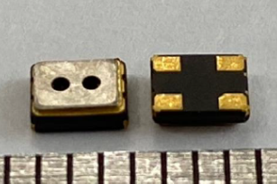
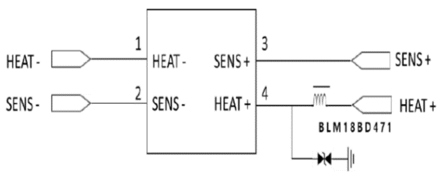
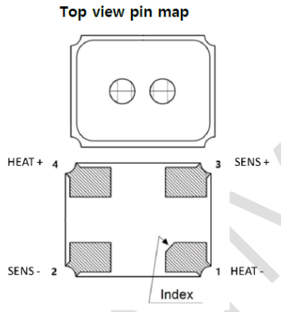
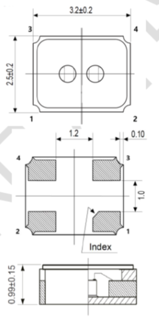

# RSM411 - 공기질 센서 \(MEMS\)

## 1. Features

* High sensitivity Air contaminant gases - CO / Ethanol / HCHO / etc.
* Surface mount package
* Low power consumption
* Less than 45mW @ 1.7V supply
* Small size
  * MEMS-based semiconductor process
  * 3.2ⅹ2.5x0.99 mm Ceramic package

## 2. Applications

* Indoor Air Quality Systems
* Air Cleaners
* IoT Devices
* Ventilation Control

## 3. Package image


Ceramic package

Surface mount type, 4-Lead  
3.2 x 2.5 x 0.99 mm


## 4. Description

The RSM411 is a Micro Electro Mechanical Systems \(MEMS\) based Air Quality Sensor which offers miniaturization and low power consumption. It can detect the gaseous air contaminants \(CO / Ethanol / HCHO / etc.\). 

In the sensor, the sensing materials are placed on the micro-heater, and the resistance of the sensing material is varied according to the concentration of the air pollution gases. The RSM411 is fabricated on the ceramic package with several holes. 

It can reduce the influence of interference gases as well as protect from humidity or dust.

> **Typical application circuit**

## 5. Pin configuration and connections

The pin configuration of RSM711 gas sensor is as follows.

| Pin No. | I/O | Connections |
| :---: | :---: | :---: |
| 1 | Ground \(G\) | Heater \(H-\) |
| 2 | Ground \(G\) | Sensing electrode \(S-\) |
| 3 | Output \(O\) | Sensing electrode \(S+\) |
| 4 | Power supply \(P\) | Heater \(H+\) |

## 6. Specifications

<table>
  <thead>
    <tr>
      <th style="text-align:center">Items</th>
      <th style="text-align:center">Specifications</th>
    </tr>
  </thead>
  <tbody>
    <tr>
      <td style="text-align:center">Model name</td>
      <td style="text-align:center">RSM411</td>
    </tr>
    <tr>
      <td style="text-align:center">Sensing principle</td>
      <td style="text-align:center">MOS type (MEMS)</td>
    </tr>
    <tr>
      <td style="text-align:center">Standard package</td>
      <td style="text-align:center">4-lead ceramic PKG</td>
    </tr>
    <tr>
      <td style="text-align:center">Target gases</td>
      <td style="text-align:center">
        
Air contaminants

        
(H2, CO, Ethanol, HCHO, etc.)

      </td>
    </tr>
    <tr>
      <td style="text-align:center">Typical detection range</td>
      <td style="text-align:center">1 ~ 25 ppm of CO</td>
    </tr>
    <tr>
      <td style="text-align:center">Heater voltage (VH)</td>
      <td style="text-align:center">1.7 Vdc</td>
    </tr>
    <tr>
      <td style="text-align:center">Heater resistance (RH)</td>
      <td style="text-align:center">Approx. 40 ohm at RT</td>
    </tr>
    <tr>
      <td style="text-align:center">Heater current (IH)</td>
      <td style="text-align:center">26 mA</td>
    </tr>
    <tr>
      <td style="text-align:center">Heater power consumption (PH)</td>
      <td style="text-align:center">45 mW (typical)</td>
    </tr>
    <tr>
      <td style="text-align:center">Sensor resistance (RS)</td>
      <td style="text-align:center">10~500 K-ohm in air</td>
    </tr>
    <tr>
      <td style="text-align:center">
        
Sensitivity

        
(change ratio of Rs)

      </td>
      <td style="text-align:center">
        
~0.5

        
(Rs-gas / Rs-air @CO 10 ppm)

      </td>
    </tr>
    <tr>
      <td style="text-align:center">Standard test conditions</td>
      <td style="text-align:center">
        
Normal air at 25+/-2 C

        
60+/-5 %RH

      </td>
    </tr>
    <tr>
      <td style="text-align:center">
        
Conditioning period

        
before test

      </td>
      <td style="text-align:center">more than 12-hrs</td>
    </tr>
  </tbody>
</table>

## 7. Sensitivity Characteristics

## 8. Application guidance

Since the output of the RSM411 is a resistance, a conventional measurement part should have a current source in parallel with the output of the sensor to convert the resistance to voltage. For ESD protection, the diode or bead is also suggested in the power pin. Its configuration is illustrated in the typical application diagram.

## 9. Outline dimensions



