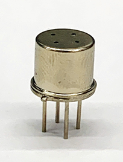
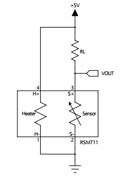
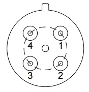
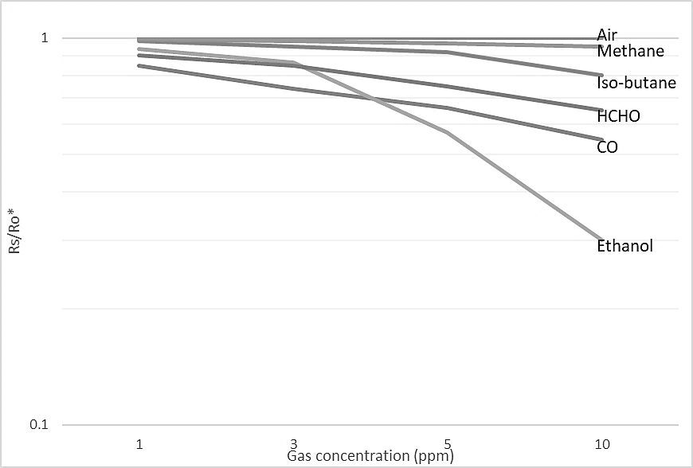
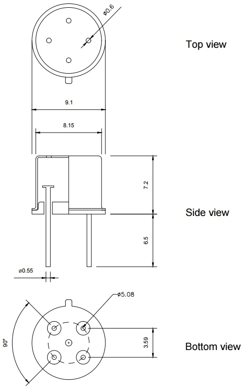

# RSM711 - 공기질 센서

## **1. Features**

* Low power consumption
* High sensitivity to gaseous Air contaminants - CO, Ethanol, HCHO, etc.
* Long life and low cost
* Uses simple electrical circuit
* Small size
* Metal can type package - TO-5

## **2. Applications**

* Air cleaners
* Ventilation control
* Indoor air quality measurement systems
* IoT devices for air quality monitors
* Gas alarm device

## **3. Package Image**

## **4. Description**

The sensing element is comprised of a metal oxide semicondector layer formed on an alumina substrate of a sensing chip together with an intergrated heater. In the presence of a detectable gas, the sensor's condectivity increases depending on the gas concentration in the air. A simple electrical circuit can convert the change in conductivity to an output signal which corresponds to the gas concentration.

The RSM711 is a metal oxide semiconductor type sensor in which a sensor layer and a heater layer are formed on an alumina substrate. It can detect the gaseous air contaminants. In the sensor, the sensing materials are placed on the alumina substrate, and the resistance of the sensing material is varied according to the concentration of the air pollution gases. The RSM711 is fabricated on the TO-5 package with several holes. It can reduce the influence of interference gases as well as protect from humidity or dust.

> #### **Typical application circuit**
>
> The sensor requires voltage input: **Heater voltage \(+5V\)**. The heater voltage \(H+, H-\) is applied to the integrated heater in order to maintain the sensing elecment at a specific temperature which is optimal for sensing**.** 
>
> Also, input voltage \(+5V\) is applied to allow measurement of of voltage across a load resistor \(RL\) which is connected in series with the sensor. The value of the load resistor \(RL\) should be chosen to optimize the alarm thresold value, keeping power consuption of the semiconductor below a limit of 30mW. Power consuption will be highest when the value of Rs is equal to RL on exposure to gas.

## **5. Pin configuration and connections**

The pin configuration of RSM711 gas sensor is as follows.

| Pin NO. | I/O | Connections |
| :---: | :---: | :---: |
| 1 | Grond \(G\) | Heater \(H-\) |
| 2 | Grond \(G\) | Sensing electrode \(S-\) |
| 3 | Oout put \(O\) | Sensing electrode \(S+\) |
| 4 | Power supply \(P\) | Heater \(H+\) |

## **6. Speccifications**

<table>
  <thead>
    <tr>
      <th style="text-align:center">Model number</th>
      <th style="text-align:center">RSM711</th>
    </tr>
  </thead>
  <tbody>
    <tr>
      <td style="text-align:center">Medel number</td>
      <td style="text-align:center">RSM711</td>
    </tr>
    <tr>
      <td style="text-align:center">Sensing principle</td>
      <td style="text-align:center">MOS type</td>
    </tr>
    <tr>
      <td style="text-align:center">Standard package</td>
      <td style="text-align:center">TO-5 PKG</td>
    </tr>
    <tr>
      <td style="text-align:center">Target gases</td>
      <td style="text-align:center">Air contaminants
         (H2, CO, Ethanol, HCHO, etc.)</td>
    </tr>
    <tr>
      <td style="text-align:center">Typical detection range</td>
      <td style="text-align:center">1 ~ 500 ppm of CO</td>
    </tr>
    <tr>
      <td style="text-align:center"></td>
      <td style="text-align:center"></td>
    </tr>
    <tr>
      <td style="text-align:center">Heater voltage (VH)</td>
      <td style="text-align:center">5.0 Vdc</td>
    </tr>
    <tr>
      <td style="text-align:center">Heater resistance (RH)</td>
      <td style="text-align:center">Approx. 83 ohm at RT</td>
    </tr>
    <tr>
      <td style="text-align:center">Heater current (IH)</td>
      <td style="text-align:center">40+/-4 mA</td>
    </tr>
    <tr>
      <td style="text-align:center">Heater power consumption (PH)</td>
      <td style="text-align:center">200 mW (typical)</td>
    </tr>
    <tr>
      <td style="text-align:center">Sensor resistance (RS)</td>
      <td style="text-align:center">10~50 M-ohm</td>
    </tr>
    <tr>
      <td style="text-align:center">
        
Sensitivity

        
(change ratio of Rs)

      </td>
      <td style="text-align:center">0.4~0.6
         (Rs-gas / Rs-air @CO 10 ppm)</td>
    </tr>
    <tr>
      <td style="text-align:center">
        
Standard test

        
conditions

      </td>
      <td style="text-align:center">
        
Normal air at 25+/-2 C

        
40+/-5 %RH

      </td>
    </tr>
    <tr>
      <td style="text-align:center">
        
Conditioning period

        
before test

      </td>
      <td style="text-align:center">3 days or longer</td>
    </tr>
  </tbody>
</table>

## **7. Sensitivity Characteristics**

 The figure below represents typical sensitivity characteristics, all data having been gathered at standard test conditions.

> Rs = Sensor resistance in displayed gases at various concentrations  
> Ro = Sensor resistance in fresh air

## **8. Application guidance**

Heater voltage is applied to the heater to maintain a specific temperature at which the sensing material is optimized for detection. DC voltage is required for the circuit.

Since the output of the sensor is a resistance, a conventional measurement part should have a current source in parallel with the output of the sensor to convert the resistance to voltage.

The change of the sensor resistance \(RS\) is obtained as the change of the output voltage across a load resistor \(RL\) which is connected in series with the sensor.

## **9. Outline dimensions**

## 



