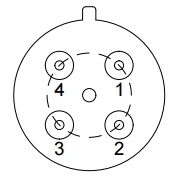

# RSM741 - 메탄 센서

## 1. **Features**

* High sensitivity to Methane gases
* Low power consumption
  * Approx. 300mW @ 5.0V supply
* Small size
* Metal can type package - TO-5
* Uses simple electrical circuit

## **2. Applications**

* Portable gas detectors
* IoT devices
* Ventilation control
* Gas alarm device

## 3. Package image

## 4. Description

The RSM741 is a metal oxide semiconductor type sensor in which a sensor layer and a heater layer are formed on an alumina substrate. It can detect the methane \(CH4\) gas In the sensor, the sensing materials are placed on the alumina substrate , and the resistance of the sensing material is varied according to the concentration of the methane \(CH4\) gas The RSM741 is fabricated on the TO-5 package with several holes. It can reduce the influence of interference gases as well as protect from humidity or dust.

> **Typical application circuit**
>
> The sensor requires voltage input: **Heater voltage \(+5V\)**. The heater voltage \(H+, H-\) is applied to the integrated heater in order to maintain the sensing element at a specific temperature which is optimal for sensing.
>
> Also, input voltage \(+5V\) is applied to allow measurement of of voltage across a load resistor \(RL\) which is connected in series with the sensor. The value of the load resistor \(RL\) should be chosen to optimize the alarm threshold value, keeping power consumption of the semiconductor below a limit of 30mW. Power consumption will be highest when the value of Rs is equal to RL on exposure to gas.

## 5. Pin configuration and connections

The pin configuration of RSM711 gas sensor is as follows.

| Pin No. | I/O | Connections |
| :---: | :---: | :---: |
| 1 | Ground \(G\) | Heater \(H-\) |
| 2 | Ground \(G\) | Sensing electrode \(S-\) |
| 3 | Output \(O\) | Sensing electrode \(S+\) |
| 4 | Power supply \(P\) | Heater \(H+\) |

## 6. Specifications

<table>
  <thead>
    <tr>
      <th style="text-align:center">Items</th>
      <th style="text-align:center">Specifications</th>
    </tr>
  </thead>
  <tbody>
    <tr>
      <td style="text-align:center">Model name</td>
      <td style="text-align:center">RSM741</td>
    </tr>
    <tr>
      <td style="text-align:center">Sensing principle</td>
      <td style="text-align:center">MOS type</td>
    </tr>
    <tr>
      <td style="text-align:center">Standard package</td>
      <td style="text-align:center">TO-5 PKG</td>
    </tr>
    <tr>
      <td style="text-align:center">Target gases</td>
      <td style="text-align:center">Methane (CH4)</td>
    </tr>
    <tr>
      <td style="text-align:center">Typical detection range</td>
      <td style="text-align:center">500~10,000 ppm</td>
    </tr>
    <tr>
      <td style="text-align:center">Heater voltage (VH)</td>
      <td style="text-align:center">5.0 Vdc</td>
    </tr>
    <tr>
      <td style="text-align:center">Heater resistance (RH)</td>
      <td style="text-align:center">Approx. 59 ohm at RT</td>
    </tr>
    <tr>
      <td style="text-align:center">Heater current (IH)</td>
      <td style="text-align:center">56 +/- 5 mA</td>
    </tr>
    <tr>
      <td style="text-align:center">Heater power consumption (PH)</td>
      <td style="text-align:center">280 +/- 25 mW (typical)</td>
    </tr>
    <tr>
      <td style="text-align:center">Sensor resistance (RS)</td>
      <td style="text-align:center">0.5~5.0 M-ohm in Air</td>
    </tr>
    <tr>
      <td style="text-align:center">
        
Sensitivity

        
(Change ratio of RS)

      </td>
      <td style="text-align:center">
        
~0.5

        
(Rs/Rs-air @CH4 1,000 ppm)

      </td>
    </tr>
    <tr>
      <td style="text-align:center">Standard test conditions</td>
      <td style="text-align:center">
        
Normal air at 25+/-2 C

        
40+/-5 %RH

      </td>
    </tr>
    <tr>
      <td style="text-align:center">
        
Conditioning period

        
before test

      </td>
      <td style="text-align:center">3-days or longer</td>
    </tr>
  </tbody>
</table>

## 7. Sensitivity Characteristics

The figure below represents typical sensitivity characteristics, all data having been gathered at standard test conditions.

> Rs = Sensor resistance in displayed gases at various concentrations  
> Ro = Sensor resistance in 5000ppm of methane \(CH4\)

## 8. Application guidance

Heater voltage is applied to the heater to maintain a specific temperature at which the sensing material is optimized for detection. DC voltage is required for the circuit. 

Since the output of the sensor is a resistance, a conventional measurement part should have a current source in parallel with the output of the sensor to convert the resistance to voltage. 

The change of the sensor resistance \(RS\) is obtained as the change of the output voltage across a load resistor \(RL\) which is connected in series with the sensor.

## 9. Outline dimensions



