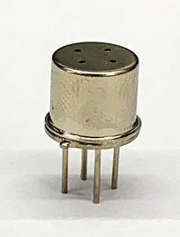

# RSM741 - 메탄 센서

## 1. **Features**

* High sensitivity to Methane gases
* Low power consumption
  * Approx. 300mW @ 5.0V supply
* Small size
* Metal can type package - TO-5
* Uses simple electrical circuit

## **2. Applications**

* Portable gas detectors
* IoT devices
* Ventilation control
* Gas alarm device

## 3. Package image

## 4. Description

The RSM741 is a metal oxide semiconductor type sensor in which a sensor layer and a heater layer are formed on an alumina substrate. It can detect the methane \(CH4\) gas In the sensor, the sensing materials are placed on the alumina substrate , and the resistance of the sensing material is varied according to the concentration of the methane \(CH4\) gas The RSM741 is fabricated on the TO-5 package with several holes. It can reduce the influence of interference gases as well as protect from humidity or dust.

> **Typical application circuit**
>
> The sensor requires voltage input: **Heater voltage \(+5V\)**. The heater voltage \(H+, H-\) is applied to the integrated heater in order to maintain the sensing element at a specific temperature which is optimal for sensing.
>
> Also, input voltage \(+5V\) is applied to allow measurement of of voltage across a load resistor \(RL\) which is connected in series with the sensor. The value of the load resistor \(RL\) should be chosen to optimize the alarm thresold value, keeping power consuption of the semiconductor below a limit of 30mW. Power consuption will be highest when the value of Rs is equal to RL on exposure to gas.

